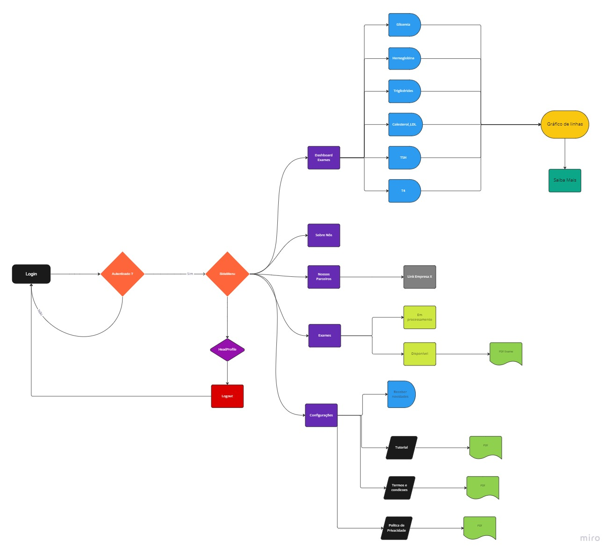
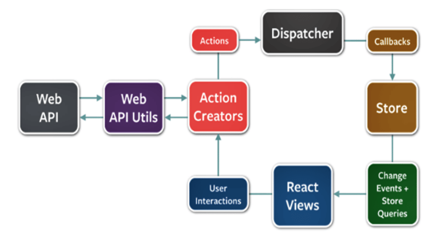

# Descrição e objetivo 

A partir de um cenário otimista em que temos unificados esses dados da saúde como
mencionados acima, nos deparamos com um novo problema à frente. Como seria possível
colocar a análise desses dados e todo estudo prévios de fato no cotidiano das pessoas.

A parte prática deste trabalho vai abordar esse ponto. Estamos partindo de um contexto real, onde a grande maioria das pessoas não sabe como aproveitar a tecnologia disponível ao seu redor para o seu benefício, é um conhecimento desconhecido, que ainda é pertencente à minoria. É necessário a montagem de uma aplicação simples, intuitiva e de fácil acesso para trazer esse privilégio da informação médica para ela da maneira mais fácil possível. 

Para isso, vamos desenvolver uma aplicação web onde ela possa ter uma fácil visualização de seus dados. Eles incluem seu histórico de exames, seus diagnósticos passados, seu histórico hospitalar, condições de saúde tratadas recorrentemente e sugestões inteligentes para acompanhamento médico. É extremamente importante termos uma interface bem desenvolvida, a fim de facilitar ao máximo o uso da plataforma. Nosso objetivo é termos uma aplicação simples, eficiente, agradável e fácil de ser manipulada desde pessoas com o mínimo conhecimento tecnológico desde aquelas que estão acostumadas a lidar com elas no dia a dia.  

A princípio, nosso MVP foca no lado do paciente, tendo casos de uso e histórias focadas em seus interesses e suas necessidades. Porém, sendo um caso bem sucedido, nada nos impede de termos features futuras para o lado do médico e instituição de saúde responsável, aplicando os mesmos conceitos e princípios apresentados previamente, sempre tendo como objetivo ter uma plataforma unificada, organizada e efetiva para a saúde pública. 

Como mencionado nos tópicos anteriores, foi desenvolvido uma aplicação web para suprir as demandas e usufruir ao máximo da iniciativa open-health. Além de se tratar de um assunto muito sensível, a quantidade de dados e requisições que a plataforma tem que lidar é muito grande, sendo de extrema importância termos decisões precisas nas tecnologias a serem usadas no desenvolvimento do software, pensando nos seus benefícios e impedimentos que cada uma pode trazer. 

Para o desenvolvimento do front-end, foi utilizado o framework React.js. A vantagem obtida com o React é a sua forte capacidade de reutilização de componentes, o que nos dá uma grande vantagem em quesitos de evitar duplicação de código desnecessária e evitar re-renderizações que prejudicam tanto o desempenho quanto a experiência do usuário com o site.  

Juntamente disso, foi elaborada uma estrutura de pastas e organizações de arquivos a fim de facilitar a manutenção e entendimento do código ao máximo. Temos pastas intuitivas e separadas em tópicos como: componentes, constantes, helpers, páginas, rotas, utils, entre outras. Durante a montagem dessa estrutura, foi extremamente importante já se ter em mente a capacidade de expansão do projeto, da sua necessidade, às vezes não imediata, de possuir muitas interações, requisições, componentes e chamadas de api. 

Outro ponto, de grande dificuldade, no projeto é a questão de controles de estados globais. Comuns em aplicações front-end os estados globais são muito importantes para validação de condicionais e  acionamento de ações na aplicação. Por se tratar de um projeto com muito potencial de crescimento, foi utilizado a biblioteca Redux para esse controle de estado. Embora mais complexo de ser instalado, o redux utiliza arquivos actions e sagas, controlando cada passo das alterações dos estados no app. As requisições para o back-end também são montadas nele, em conjunto com a biblioteca Axios. Através dela temos um melhor controle do que está sendo enviado e recebido em cada requisição, e a partir daí, temos liberdade para trabalhar com os dados recebidos em nossa plataforma. Uma grande vantagem do uso do Redux em vez de outras bibliotecas para esse controle é a sua padronização e capacidade de crescimento. Os arquivos possuem um padrão para cada estado e cada requisição, e cada função dentro dele é independente de outras, ou seja, podemos adicionar e remover funcionalidades ao longo do tempo sem impactar as outras e sem ter que alterar a estrutura do código. Isso nos dá uma grande vantagem para implementação de funcionalidades futuras e capacidade de crescimento do app. 

Com esse conjunto de bibliotecas, implementamos a arquitetura  flux na aplicação. A arquitetura flux é um modelo unidirecional de dados onde a interação do usuário vai provocar um evento no formato de uma action específica. Essa ação vai despachar o evento para a modificação de um dados, que vai modificar o store de dados e, por fim, este vai enviar um evento de atualização da visualização. Ao final, a visualização vai consumir os dados das mais variadas formas. A arquitetura flux tem uma série de propriedades que a torna singular e promove uma série de vantagens quando comparada às demais arquiteturas de software. Essa arquitetura mantém todos os dados centralizados em um único ponto e faz com que o fluxo de dados seja explícito, fácil de desenvolver e dar manutenção. 

